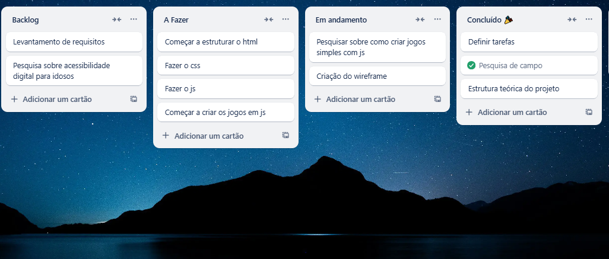

# Introdução

Informações básicas do projeto.

* **Projeto:** envelhecerdigital
* **Repositório GitHub:** [LINK PARA O REPOSITÓRIO NO GITHUB]
* **Membros da equipe:**

  * [Anthony](https://github.com/anthonyfreitasborges) 
  * [Fábio Garcia](https://github.com/Fabiogarcia02) 
  * [ Francisco Sacchetto](https://github.com/cicrano) 
  * [João Pedro](https://github.com/fulano) 
  * [João Vitor Porto Lorencini](https://github.com/jvplorencini) 

A documentação do projeto é estruturada da seguinte forma:

1. Introdução :
2. Contexto: 
3. Product Discovery 
4. Product Design
5. Metodologia
6. Solução
7. Referências Bibliográficas

# Contexto

Nosso grupo ficou responsável por desenvolver uma solução que auxilie na acessibilidade digital para idosos nas redes sociais e nos principais aplicativos que eles usam. Para isso, elaboramos uma pesquisa para entender as principais dificuldades enfrentadas por esse público.Durante a investigação, entrevistamos pessoas idosas para saber como se sentem ao usar tecnologias digitais. Observamos que muitos se sentem excluídos do ambiente digital e encontram obstáculos tanto em atividades simples, como fazer transferências bancárias, quanto em momentos de lazer. Muitos precisam recorrer à ajuda de familiares, o que gera desconforto e sensação de incapacidade. Assim sendo, decidimos criar uma aplicação web simples, dinâmica e eficaz, com a proposta de ensinar os idosos a utilizar os principais aplicativos de redes sociais e bancos, como a Caixa e o Banco do Brasil por exemplo.
Como nosso projeto é voltado para idosos que têm dificuldades em utilizar tecnologias digitais, o objetivo é tornar esse ambiente mais acessível para eles.

## Problema

Muitos idosos enfrentam dificuldades para utilizar tecnologias digitais, especialmente aplicativos de redes sociais e bancos, o que os leva a depender da ajuda de terceiros e gera sentimentos de exclusão, insegurança e incapacidade no uso do ambiente digital.


## Objetivos

Desenvolver uma aplicação web simples, dinâmica e acessível que auxilie idosos a utilizarem os principais aplicativos de redes sociais e bancos, promovendo inclusão digital e autonomia no uso da tecnologia.
>

## Justificativa

Com o avanço da tecnologia e a digitalização de serviços essenciais, como bancos e redes sociais, muitos idosos têm enfrentado dificuldades para acompanhar essas mudanças. Esse público, em grande parte, não foi incluído no processo de alfabetização digital, o que gera exclusão, dependência de terceiros e sentimentos de insegurança ao utilizar esses recursos.po.

## Público-Alvo

Idosos que possuem dificuldades em utilizar tecnologias digitais


## Etapa de Entendimento


>
> * **Matriz CSD**:
>   

> * **Mapa de stakeholders**:
>   

> * **Entrevistas qualitativas**:
>   

> * **Highlights de pesquisa**:
>   

## Etapa de Definição

### Personas


## Histórias de Usuários


## Proposta de Valor


## Requisitos

As tabelas que se seguem apresentam os requisitos funcionais e não funcionais que detalham o escopo do projeto.

### Requisitos Funcionais

| ID     | Descrição do Requisito                                   | Prioridade |
| ------ | ---------------------------------------------------------- | ---------- |
| RF-001 | ensinar como ver o saldo                                    |ALTA       |
| RF-002 | entrar no app do no banco                                   | ALTA     |
| RF-002 | pagar a conta pelo banco                                    | ALTA     |
| RF-002 | accessar  a rede sociais                                    | MÉDIA     |
| RF-002 | navegar pela no aplicativo                                  | MÉDIA     |

### Requisitos não Funcionais

| ID      | Descrição do Requisito                                                              | Prioridade |
| ------- | ------------------------------------------------------------------------------------- | ---------- |
| RNF-001 | O sistema deve ser responsivo para rodar em um dispositivos móvel                     | ALTA       |
| RNF-002 | O sistema deve permitir a auteração de cor da pagina                                  | BAIXA      |

## Projeto de Interface

Artefatos relacionados com a interface e a interacão do usuário na proposta de solução.

### Wireframes

Estes são os protótipos de telas do sistema.

**✳️✳️✳️ COLOQUE AQUI OS PROTÓTIPOS DE TELAS COM TÍTULO E DESCRIÇÃO ✳️✳️✳️**

##### TELA XPTO ⚠️ EXEMPLO ⚠️

Descrição para a tela XPTO


> ⚠️ **APAGUE ESSA PARTE ANTES DE ENTREGAR SEU TRABALHO**
>
> Wireframes são protótipos das telas da aplicação usados em design de interface para sugerir a estrutura de um site web e seu relacionamentos entre suas páginas. Um wireframe web é uma ilustração semelhante ao layout de elementos fundamentais na interface.
>
> **Orientações**:
>
> - [Ferramentas de Wireframes](https://rockcontent.com/blog/wireframes/)
> - [Figma](https://www.figma.com/)
> - [Adobe XD](https://www.adobe.com/br/products/xd.html#scroll)
> - [MarvelApp](https://marvelapp.com/developers/documentation/tutorials/)

### User Flow


### Protótipo Interativo

**✳️✳️✳️ COLOQUE AQUI UM IFRAME COM SEU PROTÓTIPO INTERATIVO ✳️✳️✳️**

✅ [Protótipo Interativo (MarvelApp)](https://marvelapp.com/prototype/4hd6091?emb=1&iosapp=false&frameless=false)  ⚠️ EXEMPLO ⚠️

> ⚠️ **APAGUE ESSA PARTE ANTES DE ENTREGAR SEU TRABALHO**
>
> Um protótipo interativo apresenta o projeto de interfaces e permite ao usuário navegar pelas funcionalidades como se estivesse lidando com o software pronto. Utilize as mesmas ferramentas de construção de wireframes para montagem do seu protótipo interativo. Inclua o link para o protótipo interativo do projeto.

# Metodologia

Nos do grupo do projeto EnvelhecerDigital opetamos por ultilizar os principios da metodologia agil scrum, em algum dia da semana nos reunimos para saber como esta o andamento do trabalho e o que nos podemos fazer para ajudar o trabalho a ser feito mais rapido, uma das ideias foi separa  com papéis divididos com base nas competências e interesses individuais é assim fizemos a tabela:

| integrante   |  Função  |
| ------------ | -------- |
| Anthony      | Desenvolvimento Front-end |
| Fabio        | Designer UX/UI, apoi no Front-end |
| Francisco    | Desenvolvimento Front-end, pesquisa sobre como fazer jogos com js         |
| João Pedro   | Designer UX/UI |
| João Vitor   | Pesquisa e criação de jogos com js, apoio no Front-end |

O acompanhamento das tarefas foi feito através de um quadro Kanban no trello, estruturado em colunas representando o progresso das atividades.

## Ferramentas

Relação de ferramentas empregadas pelo grupo durante o projeto.

| Ambiente                    | Plataforma         | Link de acesso                                     |
| --------------------------- | ------------------ | -------------------------------------------------- |
| Processo de Design Thinking | Miro               | https://miro.com/app/dashboard/       |
| Repositório de código       | GitHub             | https://github.com/ICEI-PUC-Minas-PPLES-TI/plf-es-2025-1-ti1-0385100-envelhecerdigital |
| Protótipo Interativo        | Figma              | https://www.figma.com/design/NwIAn7SpSR8UA2bTcbS95L/Untitled?node-id=0-1&p=f&t=pAvYgJBmjWdhqCcp-0 |
| Editor de Código            | Visual Studio Code | - |
| Comunicação                 | Discord e WhatsApp | - |
| Gerenciamento de Tarefas    | Trello             | https://trello.com/b/I8ZQLtsw/kanban-quadro-modelo |

## Gerenciamento do Projeto

Divisão de papéis no grupo e apresentação da estrutura da ferramenta de controle de tarefas (Kanban).


>
> **Orientações**:
>
> - [Sobre Projects - GitHub Docs](https://docs.github.com/pt/issues/planning-and-tracking-with-projects/learning-about-projects/about-projects)
> - [Gestão de projetos com GitHub | balta.io](https://balta.io/blog/gestao-de-projetos-com-github)
> - [(460) GitHub Projects - YouTube](https://www.youtube.com/playlist?list=PLiO7XHcmTsldZR93nkTFmmWbCEVF_8F5H)
> - [11 Passos Essenciais para Implantar Scrum no seu Projeto](https://mindmaster.com.br/scrum-11-passos/)
> - [Scrum em 9 minutos](https://www.youtube.com/watch?v=XfvQWnRgxG0)

# Solução Implementada

Esta seção apresenta todos os detalhes da solução criada no projeto.

## Vídeo do Projeto

O vídeo a seguir traz uma apresentação do problema que a equipe está tratando e a proposta de solução. ⚠️ EXEMPLO ⚠️

[](https://www.youtube.com/embed/70gGoFyGeqQ)

> ⚠️ **APAGUE ESSA PARTE ANTES DE ENTREGAR SEU TRABALHO**
>
> O video de apresentação é voltado para que o público externo possa conhecer a solução. O formato é livre, sendo importante que seja apresentado o problema e a solução numa linguagem descomplicada e direta.
>
> Inclua um link para o vídeo do projeto.

## Funcionalidades

Esta seção apresenta as funcionalidades da solução.Info

##### Funcionalidade 1 - Cadastro de Contatos ⚠️ EXEMPLO ⚠️

Permite a inclusão, leitura, alteração e exclusão de contatos para o sistema

* **Estrutura de dados:** [Contatos](#ti_ed_contatos)
* **Instruções de acesso:**
  * Abra o site e efetue o login
  * Acesse o menu principal e escolha a opção Cadastros
  * Em seguida, escolha a opção Contatos
* **Tela da funcionalidade**:


> ⚠️ **APAGUE ESSA PARTE ANTES DE ENTREGAR SEU TRABALHO**
>
> Apresente cada uma das funcionalidades que a aplicação fornece tanto para os usuários quanto aos administradores da solução.
>
> Inclua, para cada funcionalidade, itens como: (1) titulos e descrição da funcionalidade; (2) Estrutura de dados associada; (3) o detalhe sobre as instruções de acesso e uso.

## Estruturas de Dados

Descrição das estruturas de dados utilizadas na solução com exemplos no formato JSON.Info

##### Estrutura de Dados - Contatos   ⚠️ EXEMPLO ⚠️

Contatos da aplicação

```json
  {
    "id": 1,
    "nome": "Leanne Graham",
    "cidade": "Belo Horizonte",
    "categoria": "amigos",
    "email": "Sincere@april.biz",
    "telefone": "1-770-736-8031",
    "website": "hildegard.org"
  }
  
```

##### Estrutura de Dados - Usuários  ⚠️ EXEMPLO ⚠️

Registro dos usuários do sistema utilizados para login e para o perfil do sistema

```json
  {
    id: "eed55b91-45be-4f2c-81bc-7686135503f9",
    email: "admin@abc.com",
    id: "eed55b91-45be-4f2c-81bc-7686135503f9",
    login: "admin",
    nome: "Administrador do Sistema",
    senha: "123"
  }
```

> ⚠️ **APAGUE ESSA PARTE ANTES DE ENTREGAR SEU TRABALHO**
>
> Apresente as estruturas de dados utilizadas na solução tanto para dados utilizados na essência da aplicação quanto outras estruturas que foram criadas para algum tipo de configuração
>
> Nomeie a estrutura, coloque uma descrição sucinta e apresente um exemplo em formato JSON.
>
> **Orientações:**
>
> * [JSON Introduction](https://www.w3schools.com/js/js_json_intro.asp)
> * [Trabalhando com JSON - Aprendendo desenvolvimento web | MDN](https://developer.mozilla.org/pt-BR/docs/Learn/JavaScript/Objects/JSON)

## Módulos e APIs

Esta seção apresenta os módulos e APIs utilizados na solução

**Images**:

* Unsplash - [https://unsplash.com/](https://unsplash.com/) ⚠️ EXEMPLO ⚠️

**Fonts:**

* Icons Font Face - [https://fontawesome.com/](https://fontawesome.com/) ⚠️ EXEMPLO ⚠️

**Scripts:**

* jQuery - [http://www.jquery.com/](http://www.jquery.com/) ⚠️ EXEMPLO ⚠️
* Bootstrap 4 - [http://getbootstrap.com/](http://getbootstrap.com/) ⚠️ EXEMPLO ⚠️

> ⚠️ **APAGUE ESSA PARTE ANTES DE ENTREGAR SEU TRABALHO**
>
> Apresente os módulos e APIs utilizados no desenvolvimento da solução. Inclua itens como: (1) Frameworks, bibliotecas, módulos, etc. utilizados no desenvolvimento da solução; (2) APIs utilizadas para acesso a dados, serviços, etc.

# Referências

As referências utilizadas no trabalho foram:

* https://oimparcial.com.br/negocios/2024/11/desafios-tecnologicos-comuns-enfrentados-pelos-idosos/
* https://www.mapfre.com/pt-br/actualidade/sustentabilidade/como-e-a-relacao-entre-idosos-e-tecnologia/
* https://www.editorarealize.com.br/editora/anais/cieh/2019/TRABALHO_EV125_MD1_SA9_ID1712_27052019125015.pdf

